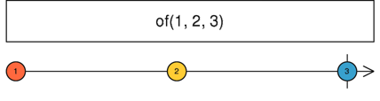
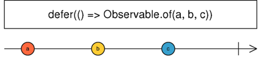
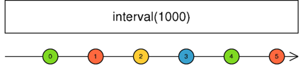
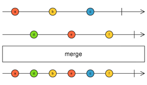
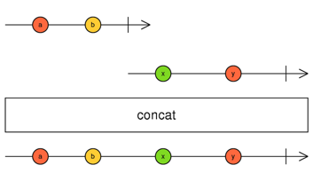
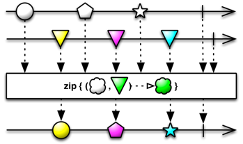
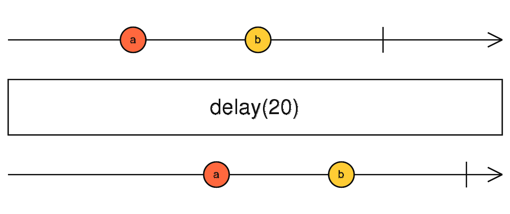
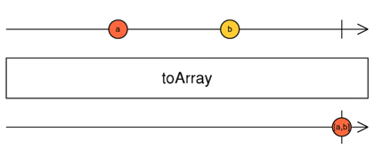
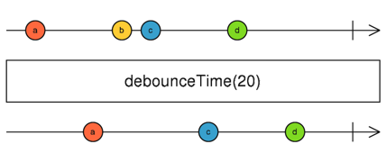
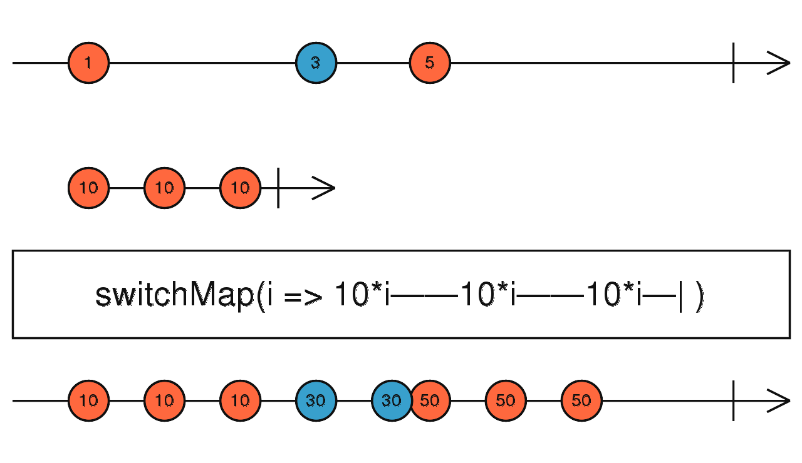

# RxJS 快速入门

> 这是一篇给新手的 RxJS 快速入门，它可能不精确、不全面，但力求对新手友好。

## 异步与“回调地狱”

我们都知道 JavaScript 是个多范式语言，它既支持过程式编程，又支持函数式编程，两者分别适用于不同的场合。在同步环境下，两者各有优缺点，甚至有时候过程式会更简明一些，但在异步环境下（最典型的场景是一个 Ajax 请求完成后紧接着执行另一个 Ajax 请求），由于无法控制执行和完成的顺序，所以就无法使用传统的过程式写法，函数式就会展现出其优势。

问题在于，传统的函数式写法实在太不友好了。

传统写法下，当我们调用一个 Ajax 时，就要给它一个回调函数，这样当 Ajax 完成时，就会调用它。当逻辑简单的时候，这毫无问题。但是我要串起 10 个 Ajax 请求时该怎么办呢？十重嵌套吗？恩？似乎有点不对劲儿！

这就是回调地狱。

不仅如此，有时候我到底需要串起多少个 Ajax 请求是未知的，要串起哪些也同样是未知的。这已经不再是地狱，而是《Mission: Impossible》了。

## 我，承诺（Promise），帮你解决

事实上，这样的问题早在 1976 年就已经被发现并解决了。注意，我没写错，确实是 1976 年。

承诺，英文是 Promise `[ˈprɑmɪs]`，它的基本思想是借助一个代表回执的变量来把回调地狱拍平。

我们以购物为例来看看日常生活中的承诺。

1. 你去电商平台下单，并付款
1. 平台会给你一个订单号，这个订单号本质上是一个回执，代表商家做出了“稍后我将给你发货”的承诺
1. 商家发货给你，在这个过程中你不用等待（异步）
1. 过一段时间，快递到了
1. 你签收（回调函数被调用）商品（回调参数）
1. 这次承诺结束

这是最直白的单步骤回调，如果理解了它，再继续往下看。

你跟电商下的单，但是却从快递（并不属于商家）那里接收到了商品，仔细想想，你不觉得奇怪吗？虽然表面看确实是商家给你的商品，但我们分解开中间步骤就会发现还有一些幕后的步骤。

1. 商家把商品交给快递公司，给快递公司一个订单号（老的回执）并拿回一个运单号（新的回执）
1. 快递公司执行这个新承诺，这个过程中商家不用等待（异步）
1. 快递公司完成这个新承诺，你收到这个新承诺携带的商品

所以，事实上，这个购物流程包括两个承诺：

1. 商家对你的一个发货承诺
2. 快递公司对商家的运货承诺

因此，只要把这些承诺串起来，这些异步动作也就同样串起来了。

当我们把每个承诺都抽象成一个对象时，我们就可以对任意数量、任意顺序的承诺进行组合，变成一个新的承诺。因此回调地狱不复存在，前述的 Mission 也变得 Possible 了。

## Promise 的缺点

Promise 固然是一个重大的进步，但在有些场景下仍然是不够的。比如，Promise 的特点是无论有没有人关心它的执行结果，它都会立即开始执行，并且你没有机会取消这次执行。显然，在某些情况下这么做是浪费的甚至错误的。仍然以电商为例，如果某商户的订单不允许取消，你还会去买吗？再举个编程领域的例子：如果你发起了一个 Ajax 请求，然后用户导航到了另一个路由，显然，你这个请求如果还没有完成就应该被取消，而不应该发出去。但是使用 Promise，你做不到，不是因为实现方面的原因，而是因为它在概念层（接口定义上）就无法支持取消。

此外，由于 Promise 只会承载一个值，因此当我们要处理的是一个集合的时候就比较困难了。比如对于一个随机数列（总数未知），如果我们要借助 Web API 检查每个数字的有效性，然后对前一百个有效数字进行求和，那么用 Promise 写就比较麻烦了。

我们需要一个更高级的 Promise。

## Observable

它就是可观察对象（Observable `[əbˈzɜrvəbl]`），Observable 顾名思义就是可以被别人观察的对象，当它变化时，观察者就可以得到通知。换句话说，它负责生产数据，别人可以消费它生产的数据。

如果你是个资深后端，那么可能还记得 MessageQueue 的工作模式，它们很像。如果不懂 MQ 也没关系，我还是用日常知识给你打个比方。

Observable 就像个传送带。这个传送带不断运行，围绕这个传送带建立了一条生产线，包括一系列工序，不同的工序承担单一而确定的职责。每个工位上有一个工人。

整个传送带的起点是原料箱，原料箱中的原料不断被放到传送带上。工人只需要待在自己的工位上，对面前的原料进行加工，然后放回传送带上或放到另一条传送带上即可，简单、高效、无意外 —— 符合程序员的审美。

而且这个生产线还非常先进 —— 不接单就不生产，非常有效地杜绝了浪费。

## FRP

这种设计，看上去很美，对吧？但光看着漂亮可不行，在编程时要怎么实现呢？实际上，这是一种编程范式，叫做函数响应式编程（FRP）。它比 Promise 可年轻多了，直到 1997 年**才**被人提出来。

顾名思义，FRP 同时具有函数式编程和响应式编程的特点。响应式编程是什么呢？形象的说，它的工作模式就是“饭来张口，衣来伸手”，也就是说，等待外界的输入，并做出响应。流水线每个工位上的工人正是这种工作模式。

工业上，流水线是人类管理经验的结晶，它所做的事情是什么呢？本质上就是把每个处理都局部化，以减小复杂度（降低对工人素质的要求）。而这，正是软件行业所求之不得的。响应式，就是编程领域的流水线。

那么函数式呢？函数式最显著的特征就是没有副作用，而这恰好是对流水线上每个工序的要求。显然，如果某个工序的操作会导致整个生产线平移 10 米，那么用不了多久这个生产线就要掉到海里了，这样的生产线毫无价值。

因此，响应式和函数式几乎是注定要在一起的。

## ReactiveX

2012 年，微软 .NET 开发组的一个团队为了给 LinQ 设计扩展机制而引入了 FRP 概念，却发现 FRP 的价值不止于此。于是一个新的项目出现了，它就是 ReactiveX。

严格来说 ReactiveX 应该是一**组** FRP 库，因为它几乎在每个主流语言下都提供了实现，而且这些实现都是语言原生风格的，不是简单地迁移。如果你在任何语言下用过带有 Rx 前缀的库，那多半儿就是 ReactiveX 的一个实现了，如 RxJava、Rx.NET、RxGroovy、RxSwift 等等。

ReactiveX 本身其实并不难，难的是 FRP 编程范式以及对操作符（operator）的理解。所以，只要学会了任何一个 `Rx*` 库，那么其它语言的库就可以触类旁通了。

## 宝石图

为了帮助开发者更容易地理解 ReactiveX 的工作原理，ReactiveX 开发组还设计了一种很形象的图，那就是宝石图。这货长这样（英文注释不必细看，接下来我会简单解释下）：


中间的带箭头的线就像传送带，用来表示数据序列，这个数据序列被称为“流”。上方的流叫做输入流，下方的流叫做输出流。输入流可能有多个，但是输出流只会有一个（不过，流中的每个数据项也可以是别的流）。

数据序列上的每个圆圈表示一个数据项，圆圈的位置表示数据出现的先后顺序，但是一般不会表示精确的时间比例，比如在一毫秒内接连出现的两个数据之间仍然会有较大的距离。只有少数涉及到时间的操作，其宝石图才会表现出精确的时间比例。

圆圈的最后，通常会有一条竖线或者一个叉号。竖线表示这个流正常终止了，也就是说不会再有更多的数据提供出来了。而叉号表示这个流抛出错误导致异常中止了。还有一种流，既没有竖线也没有叉号，这种叫做无尽流，比如一个由所有自然数组成的流就不会主动终止。但是要注意，无尽流仍然是可以处理的，因为需要多少项是由消费者决定的。你可以把这个“智能”传送带理解为由下一个工位“叫号”的，没“叫号”下一项数据就不会过来。

中间的大方框表示一个操作，也就是 operator —— 一个函数，比如这个图中的操作就是把输入流中的条目乘以十后放入输出流中。

看懂了宝石图，就能很形象的理解各种操作符了。

## RxJS

主角登场了。RxJS 就是 ReactiveX 在 JavaScript 语言上的实现。对于 JavaScript 程序员来说，不管你是前端还是 NodeJS 后端，RxJS 都会令你受益。

由于 JavaScript 本身的缺陷，RxJS 不得不采用了很多怪异的写法。它对于 Java / C# 等背景的程序员来说可能会显得比较怪异，不过，你可以先忽略它们，聚焦在编程范式和接下来要讲的操作符语义上。

### 典型的写法

```
of(1,2,3).pipe(
  filter(item=>item % 2 === 1),
  map(item=>item * 3),
).subscribe(item=> console.log(item))
```

它会输出：

```
3
9
```

其中 of 称为创建器（creator），用来创建流，它返回一个 Observable 类型的对象，filter 和 map 称为操作符（operator），用来对条目进行处理。这些操作符被当作 Observable 对象的 pipe 方法的参数传进去。诚然，这个写法略显怪异，不过这主要是被 js 的设计缺陷所迫，它已经是目前 js 体系下多种解决方案中相对好看的一种了。

Observable 对象的 subscribe 方法表示消费者要订阅这个流，当流中出现数据时，传给 subscribe 方法的回调函数就会被调用，并且把这个数据传进去。这个回调函数可能被调用很多次，取决于这个流中有多少条数据。

注意，Observable 必须被 subscribe 之后才会开始生产数据。如果没人 subscribe 它，那就什么都不会做。

### 简单创建器

广义上，创建器也是操作符的一种，不过这里我们把它单独拿出来讲。要启动生产线，我们得先提供原料。本质上，这个提供者就是一组函数，当流水线需要拿新的原料时，就会调用它。

你当然可以自己实现这个提供者，但通常是不用的。RxJS 提供了很多预定义的创建器，而且将来可能还会增加新的。不过，那些眼花缭乱的创建器完全没必要全记住，只要记住少数几个就够了，其它的有时间慢慢看。

#### of - 单一值转为流



它接收任意多个参数，参数可以是任意类型，然后它会把这些参数逐个放入流中。

#### from - 数组转为流


它接受一个数组型参数，数组中可以有任意数据，然后把数组的每个元素逐个放入流中。

#### range - 范围转为流


它接受两个数字型参数，一个起点，一个终点，然后按 1 递增，把中间的每个数字（含边界值）放入流中。

#### fromPromise - Promise 转为流

接受一个 Promise，当这个 Promise 有了输出时，就把这个输出放入流中。

要注意的是，当 Promise 作为参数传给 `fromPromise` 时，这个 Promise 就开始执行了，你没有机会防止它被执行。

如果你需要这个 Promise 被消费时才执行，那就要改用接下来要讲的 `defer` 创建器。

#### defer - 惰性创建流



它的参数是一个用来生产流的工厂函数。也就是说，当消费方需要流（注意不是需要流中的值）的时候，就会调用这个函数，创建一个流，并从这个流中进行消费（取数据）。

因此，当我们定义 defer 的时候，实际上还不存在一个真正的流，只是给出了创建这个流的方法，所以叫惰性创建流。

#### timer - 定时器流


它有两个数字型的参数，第一个是首次等待时间，第二个是重复间隔时间。从图上可以看出，它实际上是个无尽流 —— 没有终止线。因此它会按照预定的规则往流中不断重复发出数据。

要注意，虽然名字有相关性，但它**不是** `setTimeout` 的等价物，事实上它的行为更像是 `setInterval`。

#### interval - 定时器流



它和 timer 唯一的差别是它只接受一个参数。事实上，它就是一个语法糖，相当于 `timer(1000, 1000)`，也就是说初始等待时间和间隔时间是一样的。

如果需求确实是 `interval` 的语义，那么就优先使用这个语法糖，毕竟，从行为上它和 `setInterval` 几乎是一样的。

思考题：假设点了一个按钮之后我要立刻开始一个动作，然后每隔 1000 毫秒重复一次，该怎么做？换句话说：该怎么移除首次延迟时间？

### Subject - 主体对象

它和创建器不同，创建器是供直接调用的函数，而 Subject 则是一个实现了 Observable 接口的类。也就是说，你要先把它 `new` 出来（假设实例叫 `subject`），然后你就可以通过程序控制的方式往流里手动放数据了。它的典型用法是用来管理事件，比如当用户点击了某个按钮时，你希望发出一个事件，那么就可以调用 `subject.next(someValue)` 来把事件内容放进流中。

当你希望手动控制往这个流中放数据的时机时，这种特性非常有用。

当然，Subject 其实并没有这么简单，用法也很多，不过这部分内容超出了本文的范围。

### 合并创建器

我们不但可以直接创建流，还可以对多个现有的流进行不同形式的合并，创建一个新的流。常见的合并方式有三种：并联、串联、拉链。

#### merge - 并联



从图上我们可以看到两个流中的内容被合并到了一个流中。只要任何一个流中出现了值就会立刻被输出，哪怕其中一个流是完全空的也不影响结果 —— 等同于原始流。

这种工作方式非常像电路中的并联行为，因此我称其为并联创建器。

并联在什么情况下起作用呢？举个例子吧：有一个列表需要每隔 5 秒钟定时刷新一次，但是一旦用户按了搜索按钮，就必须立即刷新，而不能等待 5 秒间隔。这时候就可以用一个定时器流和一个自定义的用户操作流（subject）merge 在一起。这样，无论哪个流中出现了数据，都会进行刷新。

#### concat - 串联



从图中我们可以看到两个流中的内容被按照顺序放进了输出流中。前面的流尚未结束时（注意竖线），后面的流就会一直等待。

这种工作方式非常像电路中的串联行为，因此我称其为串联创建器。

串联的适用场景就很容易想象了，比如我们需要先通过 Web API 进行登录，然后取学生名册。这两个操作就是异步且串联工作的。

#### zip - 拉链



zip 的直译就是拉链，事实上，有些压缩软件的图标就是一个带拉链的钥匙包。拉链的特点是两边各有一个“齿”，两者会啮合在一起。这里的 zip 操作也是如此。

从图上我们可以看到，两个输入流中分别出现了一些数据，当仅仅输入流 A 中出现了数据时，输出流中什么都没有，因为它还在等另一个“齿”。当输出流 B 中出现了数据时，两个“齿”都凑齐了，于是对这两个齿执行中间定义的运算（取 A 的形状，B 的颜色，并合成为输出数据）。

可以看到，当任何一个流先行结束之后，整个输出流也就结束了。

拉链创建器适用的场景要少一些，通常用于合并两个数据有对应关系的数据源。比如一个流中是姓名，另一个流中是成绩，还有一个流中是年龄，如果这三个流中的每个条目都有精确的对应关系，那么就可以通过 zip 把它们合并成一个由表示学生成绩的对象组成的流。

### 操作符

RxJS 有很多操作符，事实上比创建器还要多一些，但是我们并不需要一一讲解，因为它们中的很大一部分都是函数式编程中的标配，比如 map、reduce、filter 等。有 Java 8 / scala / kotlin 等基础的后端或者用过 underscore/lodash 的前端都可以非常容易地理解它们。

本文重点讲解一些传统方式下没有的或不常用的：

#### retry - 失败时重试


有些错误是可以通过重试进行恢复的，比如临时性的网络丢包。甚至一些流程的设计还会故意借助重试机制，比如当你发起请求时，如果后端发现你没有登录过，就会给你一个 401 错误，然后你可以完成登录并重新开始整个流程。

retry 操作符就是负责在失败时自动发起重试的，它可以接受一个参数，用来指定最大重试次数。

这里我为什么一直在强调失败时重试呢？因为还有一个操作符负责成功时重试。

#### repeat - 成功时重试


除了重复的条件之外，repeat 的行为几乎和 retry 一模一样。

repeat 很少会单独用，一般会组合上 delay 操作，以提供暂停时间，否则就容易 DoS 了服务器。

#### delay - 延迟



这才是真正的 setTimeout 的等价操作。它接受一个毫秒数（图中是 20 毫秒），每当它从输入流中读取一个数据之后，会先等待 20 毫秒，然后再放到输出流中。

可以看到，输入流和输出流内容是完全一样的，只是时机上，输出流中的每个条目都恰好比输入流晚 20 毫秒出现。

#### toArray - 收集为数组



事实上，你几乎可以把它看做是 from 的逆运算。
from 把数组打散了逐个放进流中，而 toArray 恰好相反，把流中的内容收集到一个数组中 —— 直到这个流结束。

这个操作符几乎总是放在最后一步，因为 RxJS 的各种 operator 本身就可以对流中的数据进行很多类似数组的操作，比如查找最小值、最大值、过滤等。所以通常会先使用各种 operator 对数据流进行处理，等到要脱离 RxJS 的体系时，再转换成数组传出去。

#### debounceTime - 防抖



在 underscore/lodash 中这是常用函数。
所谓防抖其实就是“等它平静下来”。比如预输入（type ahead）功能，当用户正在快速打字的时候，你没必要立刻去查服务器，否则可能直接让服务器挂了，而应该等用户稍作停顿（平静下来）时再发起查询。

debounceTime 就是这样，你传入一个最小平静时间，在这个时间窗口内连续过来的数据一概被忽略，一旦平静时间超过它，就会往把接收到的下一条数据放到流中。这样消费者就只能看到平静时间超时之后发来的最后一条数据。

#### switchMap - 切换成另一个流



这可能是相对较难理解的一个 operator。

有时候，我们会希望根据一个立即数发起一个远程查询，并且把这个异步取回的结果放进流中。比如，流中是一些学生的 id，每过来一个 id，你要发起一个 Ajax 请求来根据这个 id 获取这个学生的详情，并且把详情放进输出流中。

注意，这是一个异步操作，所以你没法用普通的 map 来实现，否则映射出来的结果就会是一个个 Observable 对象。

switchMap 就是用来解决这个问题的。它在回调函数中接受从输入流中传来的数据，并转换成一个新的 Observable 对象（新的流，每个流中包括三个值，每个值都等于输入值的十倍），switchMap 会订阅这个 Observable 对象，并把它的值放入输出流中。注意图中竖线的位置 —— 只有当所有新的流都结束时，输出流才会结束。

不知道你有没有注意到这里一个很重要的细节。30 只生成了两个值，而不是我们所预期的三个。这是因为当输入流中的 5 到来时，会切换到以 5 为参数构建出的这个新流（S5），而这时候基于 3 构建的那个流（S3）尚未结束。虽然如此，但是已经没人再订阅 S3 了，因为同一时刻 switchMap 只能订阅一个流。所以，已经没人会再朝着 S3 “叫号”了，它已经被释放了。

### 规律：operator 打包学

当你掌握了一些基本操作符之后，就可以让自己的操作符知识翻倍了。

这是因为 RxJS 中的很多操作符都遵循着同样的命名模式。比如：

#### xxxWhen - 满足条件时 xxx

它接受一个 Observable 型参数作为条件流，一旦这个条件流中出现任意数据，则进行 xxx 操作。

如 `retryWhen(notifier$)`，其中的 `notifier$` 就是一个条件流。当输入流出现异常时，就会开始等待 `notifier$` 流中出现数据，一旦出现了任何数据（不管是什么值），就会开始执行重试逻辑。

#### xxxCount - 拿到 n 个数据项时 xxx

它接受一个数字型参数作为阈值，一旦从输入流中取到了 n 个数据，则进行 xxx 操作。

如 `bufferCount(3)` 表示每拿到 3 个数据就进行一次 `buffer` 操作。

这个操作可以看做是 `xxxWhen` 的语法糖。

#### xxxTime - 超时后 xxx

它接受一个超时时间作为参数，从输入流中取数据，一旦到达超时时间，则执行 xxx 操作。

比如前面讲过的 `debounceTime` 其实遵循的就是这种模式。

这个操作可以看做 `xxxWhen` 的语法糖。

#### xxxTo - 用立即量代替 Lambda 表达式

它接受一个立即量作为参数，相当于 `xxx(()=>value))`。

比如 `mapTo('a')` 其实是 `map(()=>'a')` 的语法糖，也就是说无论输入流中给出的值是什么，我往输出流中放入的都是这个固定的值。

### 坑与最佳实践

#### 取消订阅

subscribe 之后，你的回调函数就被别人引用了，因此如果不撤销对这个回调函数的引用，那么与它相关的内存就永远不会释放，同时，它仍然会在流中有数据过来时被调用，可能会导致奇怪的 console.log 等意外行为。

因此，必须找到某个时机撤销对这个回调函数的引用。但其实不一定需要那么麻烦。解除对回调函数的引用有两种时机，一种是这个流完成（complete，包括正常结束和异常结束）了，一种是订阅方主动取消。当流完成时，会自动解除全部订阅回调，而所有的有限流都是会自动完成的。只有无尽流才需要特别处理，也就是订阅方要主动取消订阅。

当调用 `Observable` 的 `subscribe` 方法时，会返回一个 `Subscription` 类型的引用，它实际上是一个订阅凭证。把它保存下来，等恰当的时机调用它的 `unsubscribe` 方法就可以取消订阅了。比如在 Angular 中，如果你订阅了无尽流，那么就需要把订阅凭证保存在私有变量里，并且在 `ngOnDestroy` 回调中调用它的 `unsubscribe` 方法。

#### 类型检查

只要有可能，请尽量使用 TypeScript 来书写 RxJS 程序。由于大量 operator 都会改变流中的数据类型，因此如果靠人力来追踪数据类型的变化既繁琐又容易出错。TypeScript 的类型检查可以给你提供很大的帮助，既省心又安全，而且这两个都是微软家的，搭配使用，风味更佳。

#### 代码风格

如同所有 FP 程序一样，ReactiveX 的代码也应该由一系列小的、单一职责的、无副作用的函数组成。虽然 JavaScript 无法像 Java 中那样对 Lambda 表达式的副作用做出编译期限制，但是仍然要遵循同样的原则，坚持无副作用和数据不变性。

## 寄语 - 实践出真知

ReactiveX 大家族看似庞大，实则简单 —— 如果你已经有了 Java 8+ / Kotlin / underscore 或 lodash 等函数式基础知识时，新东西就很少了。而当你用过 Rx 大家族中的任何一个成员时，RxJS 对你几乎是免费的，反之也一样。

唯一的问题，就是找机会实践，并体会 FRP 风格的独特之处，获得那些超乎具体技术之上的真知灼见。
